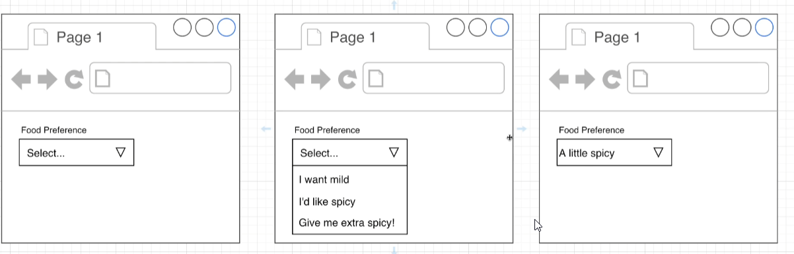
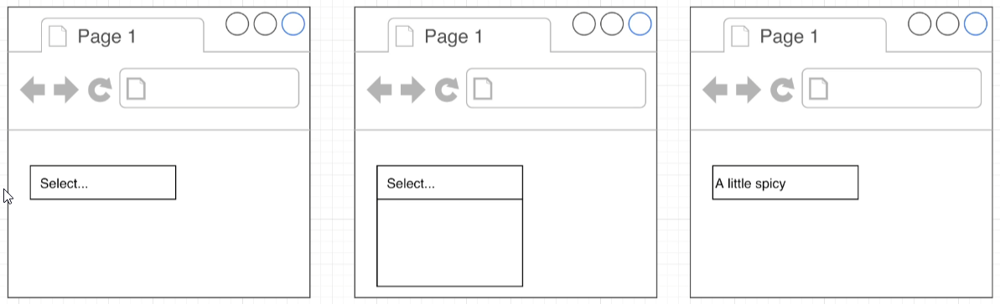
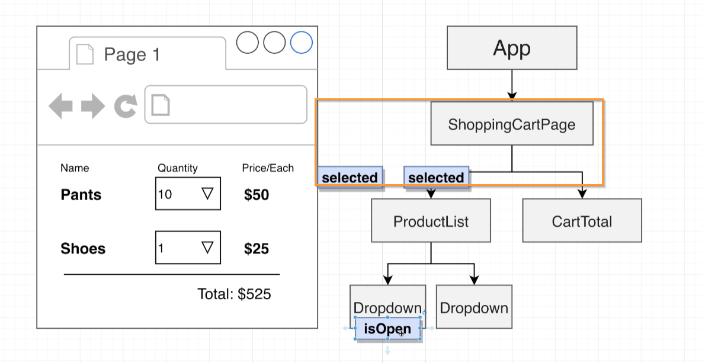
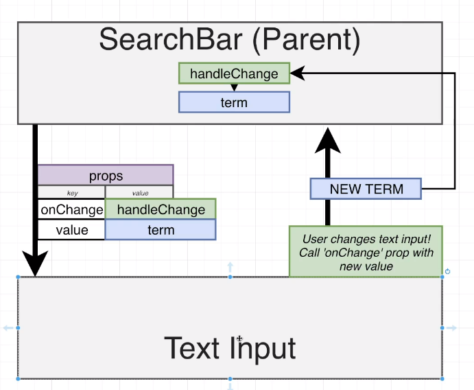
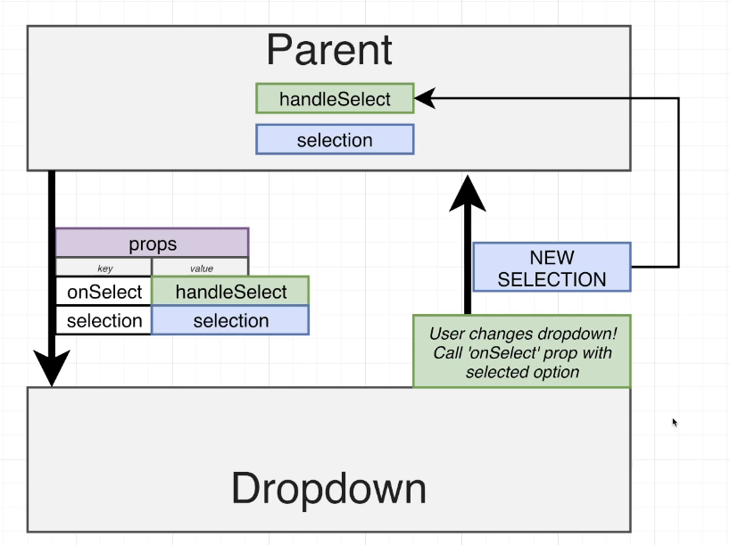
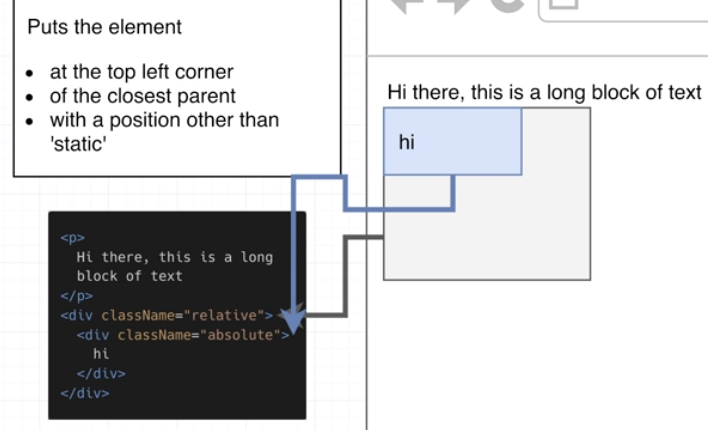
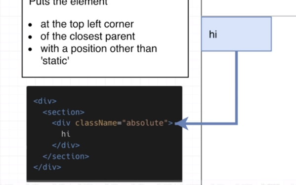
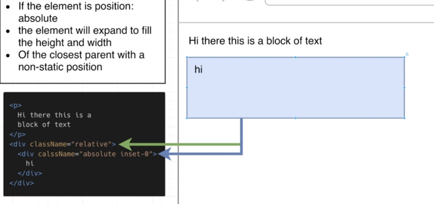
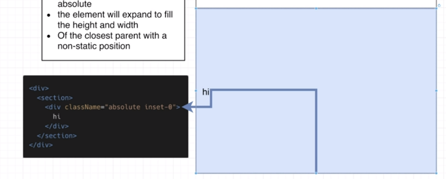

## BUTTONS

### Prop approach
`<Button text="click here"`  

### Children approach
`<Button>Click here!</Button>`  
This work fine with everything:
- plain text
- jsx components e.g. `<Icon/>`
- html elements <form> <div> etc.


`<Button primary>Clik me!</Button>` === `<Button primary={true}>Clik me!</Button>`

`<Button>Clik me!</Button>` ~~= `<Button primary={false}>Clik me!</Button>`  
It's actually `undefined`, but treated the same as `false`

## STYLING: 

### Introducing  CSS Box Model

https://www.w3schools.com/css/css_boxmodel.asp


### Classnames library:

https://www.npmjs.com/package/classnames 

``` js
import className from "classnames";
// import classnames from "classnames";  // as in documentation, both imports are correct

const finalClassName = className("py-1.5", "border", "border-sky-600")  // "py-1.5 border border-sky-600"

const finalClassName = className({
     "py-1.5": true,  // object keys cannot have dashes and special signs within it, unless is is wrapped as string (" or ')
     "border": false,
     "border-sky-600": 10,  //any truthy value
     "bg-sky-600": "",
    })  // "py-1.5 border-sky-600"

const finalClassName = className("py-1.5", {  // always
     "border": resp_1,  // the rest is conditional
     "border-sky-600": resp_2,  
     "bg-sky-600": resp_1,
    })  // "py-1.5 ...?"


const finalClassName = className("py-1.5", "border", "border-sky-600")
const finalClassName = className("py-1.5", "border", "border-sky-600")
console.log(finalClassName)  
```

### Tailwind and Tailwind-merge

https://tailwindcss.com/docs/
https://www.npmjs.com/package/tailwind-merge

### Reusable "Presentation Components"

1. Create a new component that shows a handful of JSX elements
2. Make sure component accepts and uses `{children}` prop
3. Allow extra `classNames` to be passed in and merge them - with className lib
4. Take extra prop, pass them trough to root element - with `{...rest}` prop

check implementation [here](/src/components/Panel.js)

### React-icons

https://react-icons.github.io/react-icons/

`npm install --save-exact react-icons@4.6.0`

----------------------


## Design proccess

#### What `state` and `event handlers` are there?
1. List out what a user will do and changes they will see while using the app
2. Categorize each step as `state` or `event handler`
3. Group common steps. Remove duplicaes. Rewrite descriptions.

#### What name and type?
4. Look at mockup (draft). Remove or simplify parts that aren't changing
5. Replace remaning element with text descriptions
6. Repeate #4 and #5 with a different variation
7. Imagine you have to write a function that returns the text of steps #5 and #6. In addition to your component props - what other arguments would you need?

#### Where it is defined?
8. Decide where each `event handler` and `state` will be defined

### Example (Accordian.js):

#### # What?

1. How accordion works: user clicks on section -> it should force the previously opened section to collapse and itself to expand. Actually this could be repeated for each section. 

2. State - something changes on the screen (collapses, expands). Event handler - user perform some action (clicks).

3. State - sections are collapsing and the one clicked is expanding (1). Event handler - clicking on section header (1).

#### # Name and type
__!! Avoid arrays / objects to be a type of piece of state !!__  
__number, boolean, string should be fine__

4. Text of headers does not change, text of 'body' also not change at all

5. Expanded - is a name of expanded section (1). Collapsed - name of sections that are collapsed (2+) [exp. coll. coll.]

6. [coll. exp. coll.],    [coll. coll. exp.], 

7. Imagine function, props and their types
``` js
function myFunction(items, /*???*/) {...}  
myFunction(propsItems, /*???*/);  // ['expanded', 'collapsed', 'collapsed']
myFunction(propsItems, /*???*/);  // ['collapsed', 'expanded', 'collapsed']
myFunction(propsItems, /*???*/);  // ['collapsed', 'collapsed', 'expanded']
```
/*???*/ - might be expendedIndex = 0, 1, 2; so the integer

#### # Where?
- does any other component has reasonable need to know the peace of state value? --> YES -> App.js | NO -> component.js
- event handler ususally is defined in the same component where the state it modifies (but might be used in another)

## React does not print booleans, nulls, undefined
## JS Boolean Expressions
`||` returns the __firts truthy__ value
`&&` returns the __first falsey__ value or the __last truthy__

## React useState delays:

#### PROBLEM: React updates the piece of state but not immidatiely... 
__Batching__ is an optimization of React causing above issue but allowing to update few states in the same moment - the application works fast and smooth

How to see the issue? 
Go to console:
```js
$0.click();  // opens or closes the content
$0.click(); $0.click();  // the accordion does not come back to the initial state
```
It is only a problem when clicks become very quick one after another. Normal human user wouldn't be able to do this.

#### SOLUTION 1: Force React to update instantly
Truning batching off, but slowing app down...

#### SOLUTION 2: Access the most up to date value with Functional State Update
```js
const [value, setValue] = useState(-1)
...
const handleClick = (newIdx) => {
    setValue((current) => {
    // use 'current' in the logic instead of 'value'
    })
}
```
more in components/Accordion.js or Dropdown.js

## Event handler in mapping function 

```js
const handleWithEvent = (event) => {...}
const handleWithProps = (passedOption) => {...}

consr rendered = data.map((option) => {
    return <div> onClick={handleWithEvent} </div>
    return <div> onClick={() => handleWithProps(option)} </div>
})
```

## MASTERING DESIGN PROCESS - Dropdown:

1. & 2. Steps & Categorize 
Clicks on dropdown - event
List of options appears - state
Clicks on option - event
List of options disappear - state
Clicked item appears shows in the box - state

3. Rewrite:
Events: clicks on dropdown, clicks on option (2)
States: dropdown expanded or collapsed, selected option in the box (2)

4. Look at mockup. Remove or simplify parts that aren't changing



5. Replace remaning element with text descriptions
Menu closed, no option selected
Menu opened, no option selected
Menu closed, 1st option is selected

6. Nothing to do with this simple component 

7. Funtion + other arguments needed
STATES - name and type (and possible values):
``` js
// menu open or closed
myFunction(opts: list, isOpen: boolean) // true => menu opened, false => menu closed
// selected one of the option or null
myFunction(opts: list, selested: null | opts[n]) // nothing selected, {label: x, value, x1}
```
EVENTS - names for handlers:
`handleSelect`, `handleToggle`

8. Where?

optionSelected + handleSelect ->  parent
menu opnened/closed + handleToggle -> Dropdown.js

## Handling Input aka "Controlled Input"
1. Create a new piece of state 
2. Create event handler watching on `onChange` event
3. When `onChange` event fires, get the data from the input 
4. Update the state with that data
5. Pass state to the input as the value prop

### EXAMPLE + How react renders the above:

Look at:  This will be repeated in Dropdown component - chech .

#### ad. 1. Create a new piece of state 
in parent component (SearchBar)
and pass it to the child component (TextInput) as prop named "value".  
Whenever data is passed to the "value prop" react forceably updates the text in text input

#### ad. 2. Create event handler 
called "handleChange" in parent component  
and pass it to child as onChange prop

#### ad 3. When `onChange` event fires, get the data from the input 
when user pass anythign to the input, react fires the onChange and thus hadleChange function with new data 

#### ad. 4. Update the state with that data
inside handleChange function,

#### ad. 5. Pass state to the input as the value prop
because the state was updated the parent (SearchBar) is going to rerender itself and pass new state to the value prop of child (TextInput) 
...react foceably updates the text...

## Comminity Convention with Prop Names

Refers only to child component, not the parent one - there the names (piece of state and event handler) could be whatever I choose

`form control` component - any kind of component where user provide some input value (text, text area, text input, dropdown, checkbox etc.)  
`value` - name of the prop where the current value is stored  
`onChange` - name of the prop called when value changed  

## Dropdown bug

Clicking on second dropdown (or anywhere else) should close the first dropdown - [look here](image-5.png)

### JS Solution: Document-wide event listiner 
```js
  const handleClick = (event) => {
    console.log(event.target);
  }

  document.addEventListener("click", handleClick);
```  
### Event capturing / bubbling
Whenever user interact with page (clik, drag, drop etc..) browser searches for event handlers corresponding to user action. This searching is divided into 3 phases:
`Capture Phase` --> `Target Phase` --> `Bubble Phase`

Example application:
```js
<body>
    <div>
        <button> 
            Click me!
        </button> 
    </div>
</body>
```
User clicks on button, so the browser starts searching the event handler.

#### Ad. `Capture Phase`
Browser looks at element cliked <button> and then searches from the most parent element of the target and checks if that has apropriate event handler. If no, goes to the second most etc... so <body> -> <div>. If it sees <button> this phase is going to stop/
If event handler was found, it is going to be calledn and the phase is finished.

#### Ad. `Target Phase` 
Ask the same but only the Target element, so the <button>. And call event handler if was found.

#### Ad. `Bubble Phase`
Ask the same the immediate parent elemnt <div>, and call event handler if was found. Then next parent and repeat <body>

#### Sumary
body -> div -> button -> div -> body
Capture Phase is usually disabled (skipped)

```js
document.addEventListener('click', handleClick);  // skipping capture
document.addEventListener('click', handleClick, false);  // skipping capture
document.addEventListener('click', handleClick, true);  // sets up eevent handler to start from capture phase
```

#### All together:
```js
const dropdown = document.querySelector(".w-48");  // only first element on the screen with w-48 within className
const handleClick = (event) => {
    if(dropdown.contains(event.target)) {
        console.log("Inside dropdown")
    } else {
        console.log("Outside dropdown")
    }
}
document.addEventListener("click", handleClick, true)
```

#### Explenation of 3d argument:

```js
document.addEventListener("click", handleClick, true)
```
-> users clicks an option  
-> browser starts from __capture__ phase and sees __console e.h.__ in <body> element   
-> browser calls react that calls our e.h.  
-> __react e.h.__ - state updates and React will rerender very soon, but not instantly [batching](#-PROBLEM:-React-updates-the-piece-of-state-but-not-immidatiely...)  
--> in the meantime the e.h. was called and checked whether clik was inside component or not  
--> basing on state seems to be __inside__  
-> finally React is rerendering 

 __console e.h.__ is found and called before __react e.h.__


```js
document.addEventListener("click", handleClick, false)
```
-> userss click an option  
-> browser starts from __target__ phase and sees __react e.h.__ inside dropdown's <div> tag, then goes to __bubble__ phase ..........
-> __react e.h.__ - state updates and React will rerender very soon, but not instantly [batching](#-PROBLEM:-React-updates-the-piece-of-state-but-not-immidatiely...)  
-> React is rerendering __slightly faster than the console event handler is called__
-> .......... and finds __console e.h.__  
-> browser calls react that calls our e.h.  
-> e.h. is called and checked whether click was inside compnent or not  
-> basing on state seems to be __outside__  

__react e.h.__ is found and called before __console e.h.__

#### performance.now()
```js
const dropdown = document.querySelector(".w-48");
const handleClick = (event) => {
    window.TimeThree = performance.now()
    if(dropdown.contains(event.target)) {
        console.log("Inside dropdown")
    } else {
        console.log("Outside dropdown")
    }
}
document.addEventListener("click", handleClick, true)
```
```js
timeTwo - timeOne
>>> 3
timeThree - timeTwo
>>> 6.1  // False - console e.h. called after react e.h.
>>> -1.1  // True - console e.h. called before react e.h.
```


### React-way - useEffect & useRef hooks

#### useEffect

##### Reminder on cleanUp function:
```js
useEffect(() => {
    const cleanUp = () => {}
    return cleanUp
}, [])
```
* 2nd argument = []
* * useEffect is called every 1st rendering of component (showing on the screen)
* * cleanUp (returned one) is called when component is being removed from the screen

* 2nd argument = [arg]
* * useEffect is called every time, the value of arg updates
* * "new" cleanUp is returned every time
* * cleanUp is called next time when component is rerendered (every time it is "previusly" returned clean up function)
* * order: component rerender -> previus cleanUp -> useEffect -> new cleanUp returned
* * if compinent is removed, the react calls last cleanUp   

Using of
```js
const dropdown = document.querySelector(".w-48");
```
within React useEffect would cause an issue. For mutliple components with root element <div className="w-48">, every time user click anywhere on the screen, each component event listener need to get click event - actually the exact copy of one event. So every component needs a reference to the html that it created.
--> useRef

#### useRef
* allows a component to get the reference to the DOM element that it created
* ...

1. create a _ref_ at the top of component `const divElement = useRef();`
2. assign JSX to ref prop of _ref_ '<div ref={divElement}>` 
`divElement` is pointer to html created by JSX (object with `current` property)
3. access the DOM element with `ref.current`-> `divElement.current` - 

## Routing 

### routing rules
open up the web app -> GET rquest with `localhost:3000` -> react development server responses with landing page - index.js

click on the link -> GET rquest with `localhost:3000/link` -> follow the routing rules -> show new html, or index.html if rules aren't defined

Every time browser loads new html document (new page) the old js variables and code are dumped
* no problem for html apps - one request = instantly new content on the screen (small delay)
* kind of bad for React :/ - more requests (for js and rendered components)

### Updating the address bar:

* `window.location.pathname` - everything after port (localhost:3000/dahsdqdh -> /dahsdqdh)

```js
window.location = "localhost:3000/dahsdqdh"
```
This updates the address bar but also refreshes the page

```js
window.history.pushState({}, "", "/dahsdqdh")
```
This only overwrites the address bar.  
Clicking __back__ or __forward__ buttons emits a __popstate__ event if the current url was added with _pushState_ function.

__Also the state has to be stored in parent / context to avoid losing it value__

### Common navigation libraries:
* React-Router
* Wouter
* React-Location
* Rerach-Router

### Modal component and chalanges

```js
function Modal() {
    return (
        <div>
            <div className="absolute inset-0 bg-gray-300 opacity-80"></div>
            <div className="absolute inset-40 p-10 bg-white">
                I'm a modal
            </div>
        </div>
    );
}

export default Modal;
```

#### Tailwind className -> css rule
`absolute` -> position: absolute 
`inset-0` -> top: 0; left: 0; right: 0; bottom: 0;

##### Css position property:
* static - default
* relative
* absolute: puts element: at the top left corner of the closest parent with position property other than `static` 


* fixed
* sticky

##### Css inset:
* 0: if element `position: absolute`, this element will expand to fill height and width of the closest parent with position other than `static`



__Only becouse there is no positioned parent at all the current implementation works__
__This wouldn't work in real applications__

##
